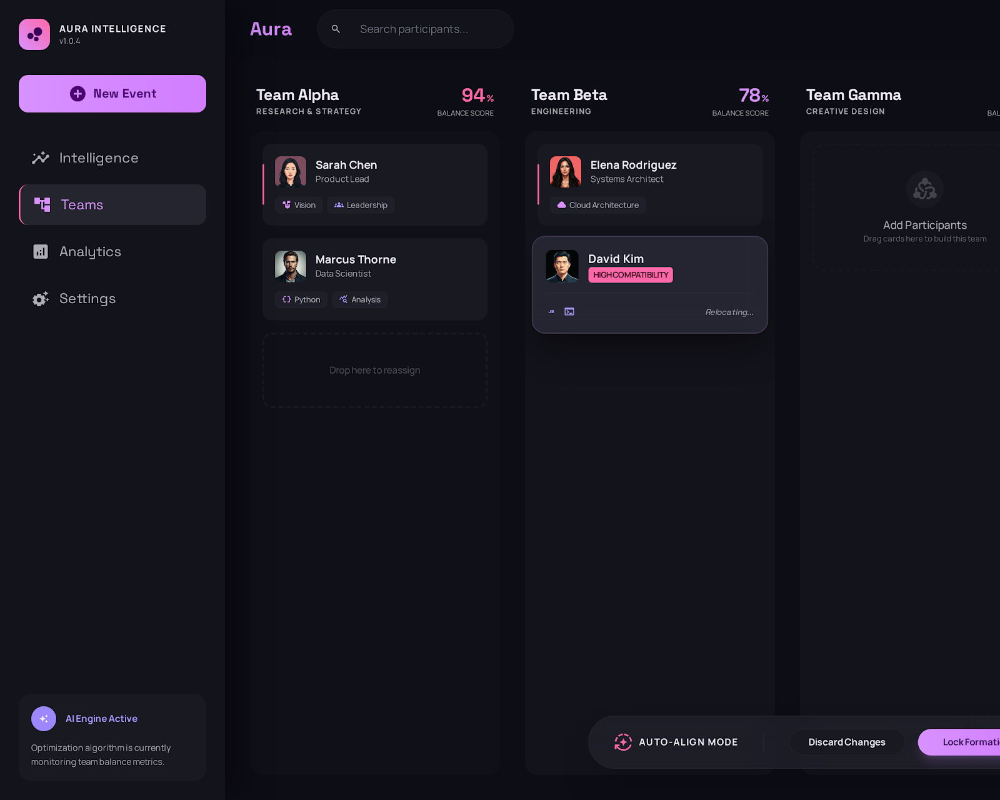
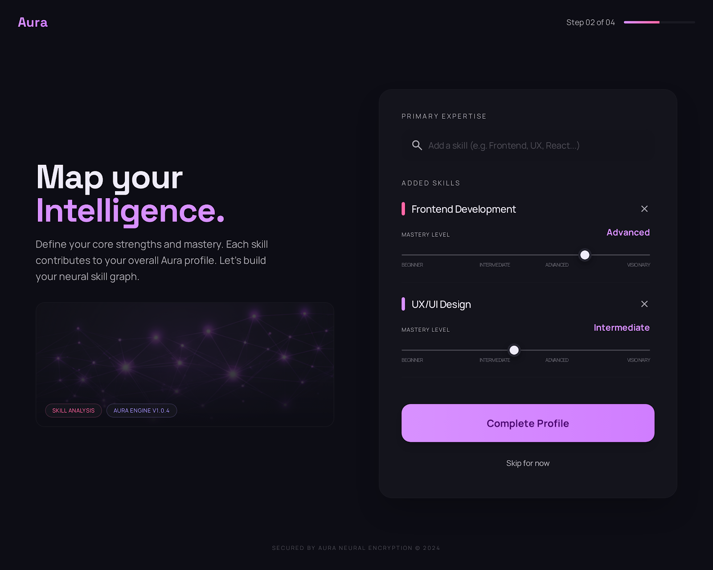
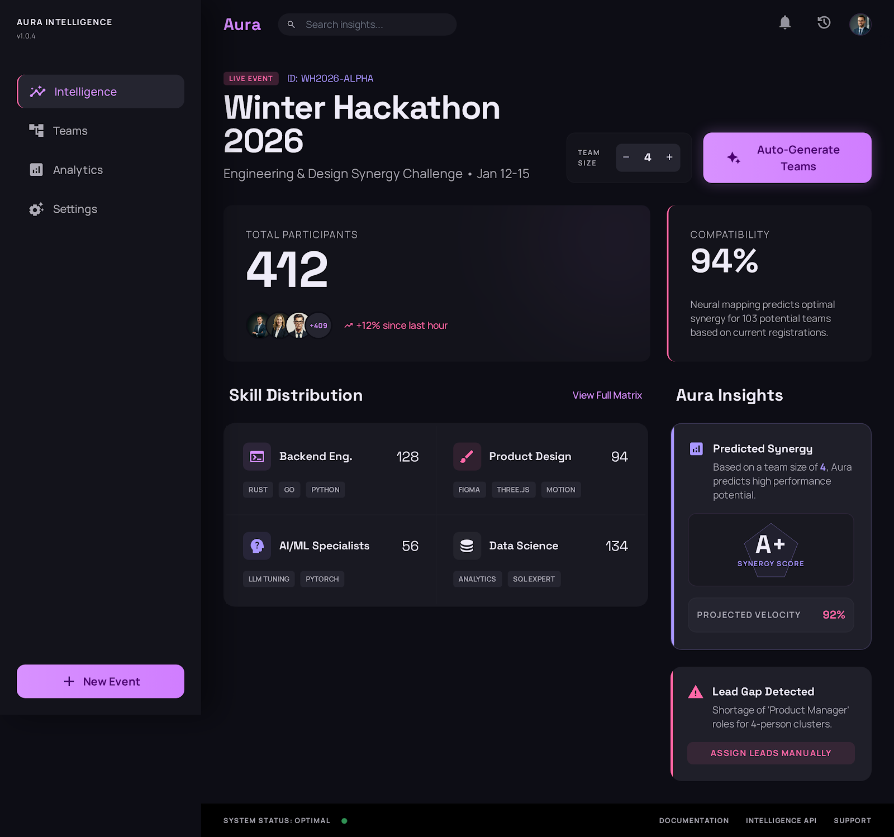
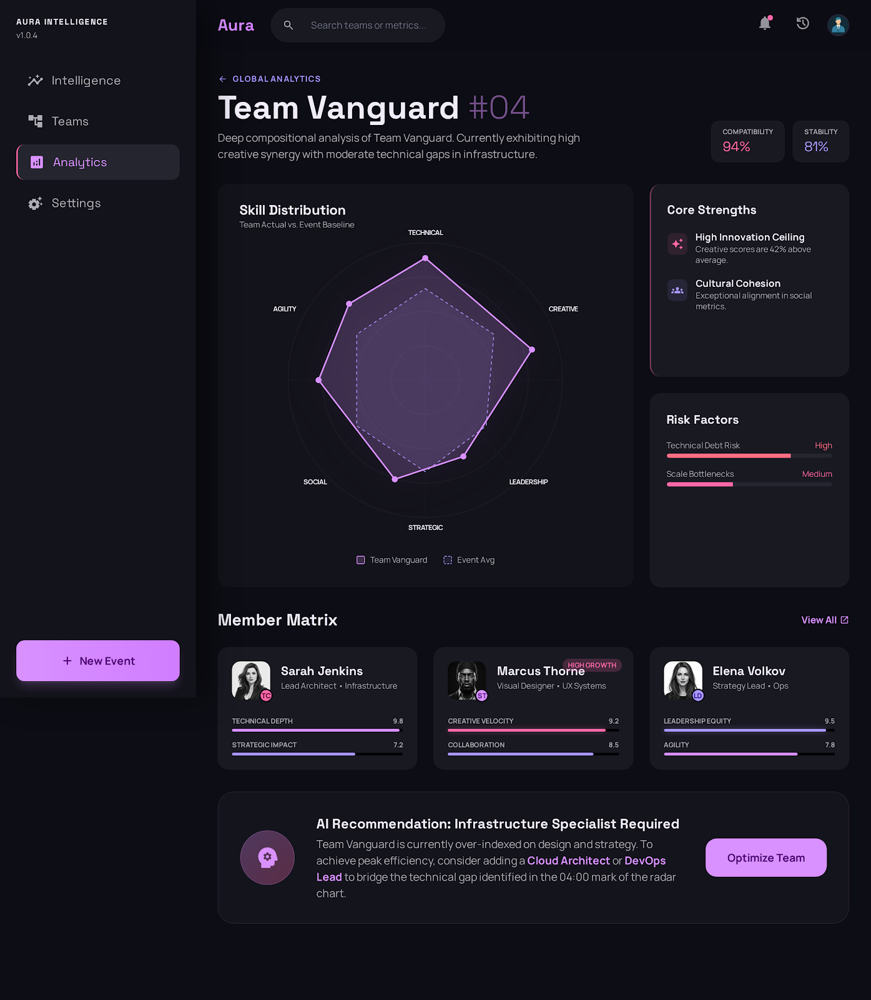

# Aura Intelligence

## Team Name
Byte Brains

## Team Members
- Manas Shinde (@manasshinde1877-cyber)
- Aradhya Verma 
- Lucky Kumar 
- Yashveer Singh
- Vagish Kumar


## Idea Chosen
3. Dynamic Team Builder


## Problem Statement
Traditional team formation often lacks depth, relying on surface-level skill matching. Aura solves this by using advanced neural mapping and behavioral analytics to synthesize high-performance teams that are balanced not just by skills, but by synergy, stability, and innovation potential.

## Tech Stack
- **React 19** & **Vite** (Core Framework)
- **Framer Motion** (Parallax & Micro-interactions)
- **Lenis** (Cinematic Smooth Scrolling)
- **Chart.js** (Neural Radar Metrics)
- **Groq AI** (Llama 3.3-70B Logic)
- **Vanilla CSS** (Neural Luminary Design System)

## Implementation Details
Aura is built with a sophisticated "AI-First" architecture:
- **Intelligent Synthesis**: A dual-provider AI engine (Groq/Hugging Face) that processes participant mastery levels to generate optimized teams.
- **Multi-Dimensional Analytics**: Real-time visualization of team strengths through radar charts, scoring teams on Technical Depth, Creativity, Leadership, and Communication.
- **Cinematic UX**: A high-fidelity scrolling experience powered by Lenis and scroll-triggered parallax effects.

## How to Run Locally
1. **Clone the repository**
   ```bash
   git clone https://github.com/manasshinde1877-cyber/Dynamic-Team-Builder.git
   cd aura-team-builder
   ```

2. **Install dependencies**
   ```bash
   npm install
   ```

3. **Configure Environment Variables**
   Create a `.env` file and add your API keys:
   ```env
   VITE_GROQ_KEY=your_groq_api_key
   VITE_HF_KEY=your_huggingface_api_key
   ```

4. **Run the development server**
   ```bash
   npm run dev
   ```

## Live Demo
[Aura Intelligence Live](https://dynamic-team-builder.vercel.app/)

## Screenshots / Demo

### 🌌 Cinematic Landing


### 🧠 Intelligence Mapping


### 📊 Tactical Dashboard


### 📈 Neural Analytics

